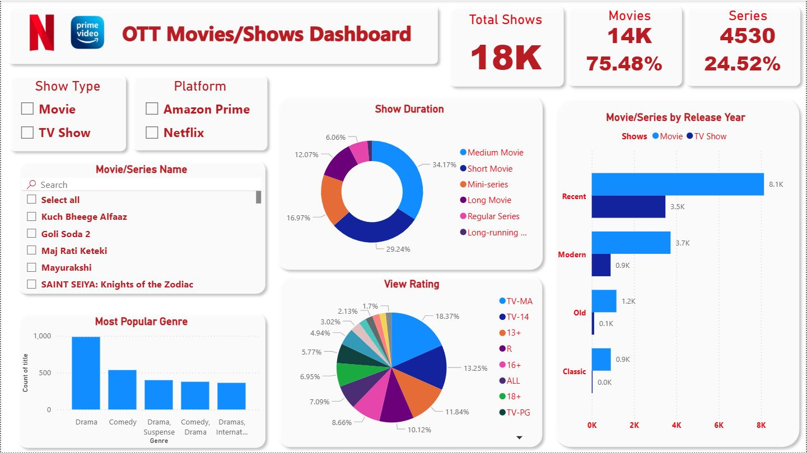

# Netflix-Amazon-Prime-Dashboard
An interactive Power BI dashboard analyzing 18,000+ movies and TV shows from Amazon Prime and Netflix. Features insights on genres, release eras, countries, runtimes, view ratings, and key trends in OTT content.

## Features

- **Overview:** Explore total counts, split between movies and TV shows, and their proportions.
- **Genre Insights:** View the most popular genres and genre trends across different release eras.
- **Release Year Analysis:** See how content volume has changed from the classic era to recent years.
- **Duration & Ratings:** Compare show/movie runtimes and distribution by view rating (TV-MA, PG-13, etc.).
- **Country Distribution:** Discover leading countries in OTT content production and regional breakdowns.
- **Details Page:** Inspect metadata for individual titles (genre, platform, director, cast, runtime, etc.).
- **Platform Trends:** Analyze movie/show releases over time per platform (Netflix vs Amazon Prime).

## Usage

1. Open the `.pbix` file with Power BI Desktop.
2. Interact with filters and slicers to explore content by genre, platform, year, country, and more.
3. The dashboard is segmented into several pages for Overview, Detailed Title Info, Geographic Insights, and Release Trends.

## Visual Highlights

- Dynamic pie and bar charts for duration, view ratings, and genre/category breakdowns.
- World map and treemap for country-wise distribution.
- Release trends by decade and by platform.

## Screenshots

## License

This project is licensed under the [MIT License](./LICENSE). Distributed for educational and analytical purposes. Please attribute if sharing or adapting.

## Author
Vaibhav Gupta
Connect with me on [LinkedIn](https://www.linkedin.com/in/vaibhav-gupta-277b03245/) | [Email](vaibhavgupta9149@gmail.com)

## Star this repo
If you found this project helpful, please consider giving it a ⭐ on GitHub!

---
